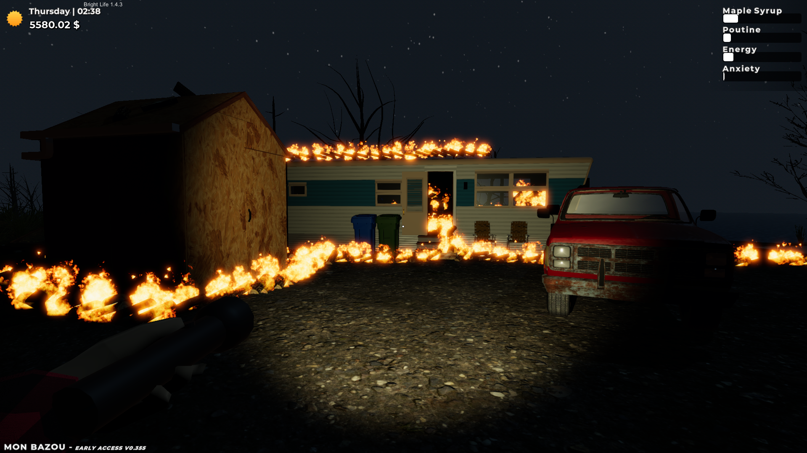

# Mon Feu de Shack

A 'Mon Bazou' (Game) role-playing and alternative story modification.

I played the original game and it felt very boring, repetetive and not very immersive, so i decided to make a mod that makes me to enjoy the game. People i showed the mod to seemed to like it so i polished it more and elaborated on the story.

## Story

### Prologue

You are Charlie Maisonbrûlé, a Canadian young adult, with roots deeply entwined in the vibrant soil of Maplewood. Your story begins not in the bustling cityscape but in the serenity of the whispering pines and the echo of tranquil lakes.

In your earlier years, life unfolded against the backdrop of the city's clamor. Towering buildings loomed overhead, their shadows casting a constant pall over your childhood. The cacophony of traffic and the relentless hustle dulled the laughter that should have echoed through your youth.

You lived with your parents in the urban maze, a place where nature was confined to sporadic parks and concrete jungles. Yet, within the constricting walls of city living, a profound realization dawned upon your father. He saw the discontent in your eyes, the longing for a life unbridled by the chains of city life.

And so, your father became the architect of your escape. Weekends were not spent amidst shopping malls or crowded streets; instead, you found solace in the embrace of nature. ATV rides through winding trails unveiled the hidden beauty of the wilderness. Fishing by the calm lake became a sacred ritual, a respite from the monotony of urban existence.

The adventures weren't confined to trails and lakes alone. Secret clearings bathed in dappled sunlight became your playgrounds. Here, amidst the wildflowers and dancing butterflies, your father unveiled the magic hidden in the simplicity of the natural world. Camping beneath the enchanted night sky, he pointed out constellations, each star a story waiting to be told.

Yet, life dealt a harsh hand. Your father, the guiding force of your idyllic childhood, was taken away. Left in the city's grip, your family struggled. Your mother, valiant but burdened, faced the uphill battle of paying bills and putting food on the table.

In the face of adversity, you made a sacrifice. Education, a gateway to a different future, took a backseat to the pressing needs of the present. You took up the mantle of responsibility, donning the hat of a construction worker.

Life at the construction site was a relentless struggle. The towering scaffolds and echoing machinery replaced the whispering pines. The harsh commands of your boss, a relentless symphony of shouts and criticisms, echoed in your ears. You were berated for perceived incompetence, your efforts often met with disdain. Each day felt like a battle against not just the construction site's challenges but also the crushing weight of your boss's disapproval.

And then, tragedy struck anew. A construction site altered the course of your journey, leaving you with a shattered leg and a head filled with trauma. The hospital became your new reality, a sterile room where pain became a constant companion. Each day felt like a year, and uncertainty gripped your spirit.

In that hospital room, the window became both a source of longing and a painful reminder of your captivity. You yearned to be free, to breathe the fresh air of the outdoors, yet your weakened body and the bars of illness kept you confined. Each passing day, you looked away from the window, your spirit breaking as you dreamed of escaping the confines of your temporary prison.

The uncertainty about your mother's well-being intensified the emotional turmoil. Your brother, residing in the woods, faced his own financial constraints, unable to provide the support your mother needed. The weight of responsibility, combined with the physical pain, cast a looming shadow over your days.

And then, by a miracle, the turning point arrived. Your health, once hanging by a fragile thread, began to mend. The spirit that had been crushed found a glimmer of resilience. In a twist of fate, you made a full recovery, defying the odds that once seemed insurmountable.

With newfound strength, you seized the opportunity to sue the construction company responsible for your misfortune. The financial compensation that followed was not just a salve for your wounds but also a lifeline for your struggling family. The funds provided not only for your mother's well-being but also paved the way for your escape from the city's grip.

Investing your newfound fortune, you purchased a piece of land in Maplewood – a verdant sanctuary untouched by the city's chaos. A quaint trailer home became your refuge, standing proudly amidst the trees. This was more than a new beginning; it was the culmination of a childhood dream, a return to the haven your father had crafted.

As the sun rises over Maplewood, casting a golden glow, you awaken in the shadow of the whispering pines. The air is tinged with the scent of earth, and the memories of your childhood haunt the rustling leaves. The canvas awaits new strokes, and the stage is set for a journey guided by echoes of laughter, lessons learned by the water's edge, and the resilience forged in the crucible of life's challenges. 

### Act 1: Escape from Haven

Maplewood awakens to an unwelcome dawn, flames devouring its tranquility. Your trailer, once a haven, now crackles with impending doom. No time for reflection, survival demands urgency.

In the clearing, an old truck awaits a rusty savior amidst chaos. Keys in hand, start the engine; it's your lifeline.

As you speed away, the distant city lights offer refuge. Time is cruel, and the flames show no mercy. The wildfire is relentless, fueled by global warming's wrath.

Escape now, or be consumed. The road to the city lights beckons, a treacherous path where survival hangs by a thread. Get out of there, or the flames will claim you.

To be continued..
